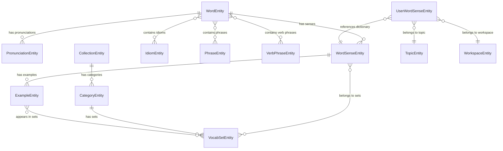

# Vocabulary Entities Documentation

Tài liệu mô tả chi tiết các entity liên quan đến hệ thống từ vựng trong ứng dụng Easy English.

---

## Mục lục

1. [WordEntity](#1-wordentity)
2. [WordSenseEntity](#2-wordsenseentity)
3. [UserWordSenseEntity](#3-userwordsenseentity)
4. [ExampleEntity](#4-exampleentity)
5. [PronunciationEntity](#5-pronunciationentity)
6. [IdiomEntity](#6-idiomentity)
7. [PhraseEntity](#7-phraseentity)
8. [VerbPhraseEntity](#8-verbphraseentity)
9. [CollectionEntity](#9-collectionentity)
10. [CategoryEntity](#10-categoryentity)
11. [VocabSetEntity](#11-vocabsetentity)
12. [Entity Relationship Diagram](#12-entity-relationship-diagram)

---

## 1. WordEntity

### Mô tả

Entity đại diện cho một **từ vựng gốc** trong hệ thống từ điển. Lưu trữ thông tin cơ bản của từ như text, phiên âm, độ phổ biến, biến thể ngữ pháp (inflections) và word family.

### Bảng Fields

| Field            | Type   | Nullable | Description                                                        |
| ---------------- | ------ | -------- | ------------------------------------------------------------------ |
| `id`             | uuid   | No       | Primary key (UUIDv7)                                               |
| `text`           | string | No       | Từ vựng gốc (ví dụ: "book")                                        |
| `normalizedText` | string | No       | Từ đã chuẩn hóa (lowercase, remove accents)                        |
| `language`       | string | No       | Ngôn ngữ (default: "en")                                           |
| `rank`           | number | Yes      | Độ phổ biến của từ (1 = phổ biến nhất)                             |
| `frequency`      | number | Yes      | Tần suất xuất hiện trong corpus                                    |
| `source`         | string | No       | Nguồn từ điển (default: "cambridge")                               |
| `inflects`       | JSON   | Yes      | Biến thể ngữ pháp: `{NNS, VBD, VBG, VBP, VBZ, JJR, JJS, RBR, RBS}` |
| `wordFamily`     | JSON   | Yes      | Word family: `{n, v, adj, adv, head}`                              |
| `updateBy`       | string | Yes      | Email người cập nhật cuối                                          |
| `createAt`       | Date   | No       | Thời gian tạo                                                      |
| `updateAt`       | Date   | No       | Thời gian cập nhật                                                 |

### Mối quan hệ

| Relation         | Type       | Target Entity       | Description                |
| ---------------- | ---------- | ------------------- | -------------------------- |
| `senses`         | OneToMany  | WordSenseEntity     | Các nét nghĩa của từ       |
| `pronunciations` | OneToMany  | PronunciationEntity | Phát âm theo vùng (UK, US) |
| `idioms`         | ManyToMany | IdiomEntity         | Thành ngữ chứa từ này      |
| `phrases`        | ManyToMany | PhraseEntity        | Cụm từ chứa từ này         |
| `verbPhrases`    | ManyToMany | VerbPhraseEntity    | Cụm động từ chứa từ này    |

---

## 2. WordSenseEntity

### Mô tả

Entity đại diện cho một **nét nghĩa cụ thể** của từ. Một từ có thể có nhiều nét nghĩa khác nhau (ví dụ: "book" có nghĩa danh từ "quyển sách" và động từ "đặt chỗ").

### Bảng Fields

| Field             | Type   | Nullable | Description                          |
| ----------------- | ------ | -------- | ------------------------------------ |
| `id`              | uuid   | No       | Primary key (UUIDv7)                 |
| `externalId`      | string | Yes      | ID từ nguồn gốc (ví dụ: "book.1.1")  |
| `partOfSpeech`    | string | No       | Từ loại (n, v, adj, adv...)          |
| `definition`      | text   | No       | Định nghĩa tiếng Anh                 |
| `definitionVi`    | text   | Yes      | Định nghĩa tiếng Việt                |
| `shortDefinition` | text   | Yes      | Định nghĩa ngắn gọn                  |
| `cefrLevel`       | string | Yes      | Cấp độ CEFR (A1, A2, B1, B2, C1, C2) |
| `senseIndex`      | number | No       | Thứ tự nét nghĩa trong entry         |
| `source`          | string | No       | Nguồn từ điển                        |
| `images`          | JSON   | Yes      | Danh sách URL hình ảnh minh họa      |
| `examples`        | JSON   | Yes      | (Deprecated) Câu ví dụ dạng string[] |
| `synonyms`        | JSON   | Yes      | Từ đồng nghĩa                        |
| `antonyms`        | JSON   | Yes      | Từ trái nghĩa                        |
| `collocations`    | JSON   | Yes      | Collocations                         |
| `relatedWords`    | JSON   | Yes      | Từ liên quan                         |
| `idioms`          | JSON   | Yes      | Thành ngữ liên quan                  |
| `phrases`         | JSON   | Yes      | Cụm từ liên quan                     |
| `verbPhrases`     | JSON   | Yes      | Cụm động từ liên quan                |
| `updateBy`        | string | Yes      | Email người cập nhật cuối            |

### Mối quan hệ

| Relation          | Type       | Target Entity  | Description                            |
| ----------------- | ---------- | -------------- | -------------------------------------- |
| `word`            | ManyToOne  | WordEntity     | Từ gốc chứa nét nghĩa này              |
| `exampleEntities` | OneToMany  | ExampleEntity  | Các câu ví dụ (thay thế JSON examples) |
| `vocabSets`       | ManyToMany | VocabSetEntity | Các bộ từ vựng chứa nét nghĩa này      |

---

## 3. UserWordSenseEntity

### Mô tả

Entity lưu trữ **từ vựng cá nhân của người dùng**. Cho phép user tùy chỉnh định nghĩa, ví dụ, hình ảnh và theo dõi tiến độ học tập.

### Bảng Fields

| Field             | Type   | Nullable | Description                                         |
| ----------------- | ------ | -------- | --------------------------------------------------- |
| `id`              | uuid   | No       | Primary key (UUIDv7)                                |
| `userId`          | string | No       | ID người dùng                                       |
| `word`            | string | No       | Từ vựng                                             |
| `language`        | string | No       | Ngôn ngữ                                            |
| `partOfSpeech`    | string | No       | Từ loại                                             |
| `definition`      | text   | No       | Định nghĩa tiếng Anh                                |
| `definitionVi`    | text   | Yes      | Định nghĩa tiếng Việt                               |
| `examples`        | JSON   | Yes      | Câu ví dụ                                           |
| `pronunciation`   | string | Yes      | Phiên âm (general)                                  |
| `pronunciationUk` | string | Yes      | Phiên âm UK                                         |
| `pronunciationUs` | string | Yes      | Phiên âm US                                         |
| `audioUk`         | string | Yes      | URL audio UK                                        |
| `audioUs`         | string | Yes      | URL audio US                                        |
| `images`          | JSON   | Yes      | Hình ảnh minh họa                                   |
| `synonyms`        | JSON   | Yes      | Từ đồng nghĩa                                       |
| `antonyms`        | JSON   | Yes      | Từ trái nghĩa                                       |
| `collocations`    | JSON   | Yes      | Collocations                                        |
| `relatedWords`    | JSON   | Yes      | Từ liên quan                                        |
| `idioms`          | JSON   | Yes      | Thành ngữ                                           |
| `phrases`         | JSON   | Yes      | Cụm từ                                              |
| `verbPhrases`     | JSON   | Yes      | Cụm động từ                                         |
| `cefrLevel`       | string | Yes      | Cấp độ CEFR                                         |
| `difficultyLevel` | enum   | No       | Độ khó (easy, medium, hard)                         |
| `learningStatus`  | enum   | No       | Trạng thái học (new, learning, reviewing, mastered) |
| `lastReviewAt`    | Date   | Yes      | Thời điểm ôn tập cuối                               |
| `media`           | JSON   | Yes      | Media bổ sung (images, videos)                      |

### Mối quan hệ

| Relation          | Type      | Target Entity   | Description                               |
| ----------------- | --------- | --------------- | ----------------------------------------- |
| `topic`           | ManyToOne | TopicEntity     | Chủ đề chứa từ này                        |
| `workspace`       | ManyToOne | WorkspaceEntity | Workspace của user                        |
| `dictionarySense` | ManyToOne | WordSenseEntity | Liên kết với nét nghĩa từ điển (optional) |

---

## 4. ExampleEntity

### Mô tả

Entity lưu trữ **câu ví dụ** cho từng nét nghĩa. Được tách riêng để hỗ trợ ManyToMany với VocabSet (một ví dụ có thể xuất hiện trong nhiều bộ từ vựng).

### Bảng Fields

| Field           | Type   | Nullable | Description                  |
| --------------- | ------ | -------- | ---------------------------- |
| `id`            | uuid   | No       | Primary key (UUIDv7)         |
| `externalId`    | string | Yes      | ID từ nguồn gốc              |
| `text`          | text   | No       | Nội dung câu ví dụ tiếng Anh |
| `translationVi` | text   | Yes      | Bản dịch tiếng Việt          |
| `order`         | number | No       | Thứ tự hiển thị (default: 0) |

### Mối quan hệ

| Relation    | Type       | Target Entity   | Description                      |
| ----------- | ---------- | --------------- | -------------------------------- |
| `sense`     | ManyToOne  | WordSenseEntity | Nét nghĩa chứa ví dụ này         |
| `vocabSets` | ManyToMany | VocabSetEntity  | Các bộ từ vựng sử dụng ví dụ này |

---

## 5. PronunciationEntity

### Mô tả

Entity lưu trữ **thông tin phát âm** theo vùng (UK, US) cho mỗi từ.

### Bảng Fields

| Field      | Type   | Nullable | Description                |
| ---------- | ------ | -------- | -------------------------- |
| `id`       | uuid   | No       | Primary key (UUIDv7)       |
| `ipa`      | string | Yes      | Ký hiệu IPA (ví dụ: /bʊk/) |
| `audioUrl` | string | Yes      | URL file audio phát âm     |
| `region`   | string | Yes      | Vùng phát âm (uk, us)      |

### Mối quan hệ

| Relation | Type      | Target Entity | Description |
| -------- | --------- | ------------- | ----------- |
| `word`   | ManyToOne | WordEntity    | Từ gốc      |

---

## 6. IdiomEntity

### Mô tả

Entity lưu trữ **thành ngữ** (idioms). Được normalize để tránh duplicate khi nhiều từ cùng liên quan đến một thành ngữ.

### Bảng Fields

| Field          | Type | Nullable | Description                 |
| -------------- | ---- | -------- | --------------------------- |
| `id`           | uuid | No       | Primary key (UUIDv7)        |
| `text`         | text | No       | Nội dung thành ngữ (unique) |
| `definition`   | text | Yes      | Định nghĩa tiếng Anh        |
| `definitionVi` | text | Yes      | Định nghĩa tiếng Việt       |

### Mối quan hệ

| Relation | Type       | Target Entity | Description                        |
| -------- | ---------- | ------------- | ---------------------------------- |
| `words`  | ManyToMany | WordEntity    | Các từ liên quan đến thành ngữ này |

---

## 7. PhraseEntity

### Mô tả

Entity lưu trữ **cụm từ** (phrases). Ví dụ: "book report", "balance the books".

### Bảng Fields

| Field          | Type | Nullable | Description              |
| -------------- | ---- | -------- | ------------------------ |
| `id`           | uuid | No       | Primary key (UUIDv7)     |
| `text`         | text | No       | Nội dung cụm từ (unique) |
| `definition`   | text | Yes      | Định nghĩa tiếng Anh     |
| `definitionVi` | text | Yes      | Định nghĩa tiếng Việt    |

### Mối quan hệ

| Relation | Type       | Target Entity | Description                     |
| -------- | ---------- | ------------- | ------------------------------- |
| `words`  | ManyToMany | WordEntity    | Các từ liên quan đến cụm từ này |

---

## 8. VerbPhraseEntity

### Mô tả

Entity lưu trữ **cụm động từ** (phrasal verbs). Ví dụ: "book in", "book someone into".

### Bảng Fields

| Field          | Type | Nullable | Description                   |
| -------------- | ---- | -------- | ----------------------------- |
| `id`           | uuid | No       | Primary key (UUIDv7)          |
| `text`         | text | No       | Nội dung cụm động từ (unique) |
| `definition`   | text | Yes      | Định nghĩa tiếng Anh          |
| `definitionVi` | text | Yes      | Định nghĩa tiếng Việt         |

### Mối quan hệ

| Relation | Type       | Target Entity | Description                          |
| -------- | ---------- | ------------- | ------------------------------------ |
| `words`  | ManyToMany | WordEntity    | Các từ liên quan đến cụm động từ này |

---

## 9. CollectionEntity

### Mô tả

Entity đại diện cho **bộ sưu tập từ vựng** cấp cao nhất. Ví dụ: "Cambridge English", "TOEFL", "Raz-Plus", "By CEFR levels".

### Bảng Fields

| Field         | Type   | Nullable | Description                                   |
| ------------- | ------ | -------- | --------------------------------------------- |
| `id`          | uuid   | No       | Primary key (UUIDv7)                          |
| `externalId`  | string | No       | ID từ nguồn gốc (unique, ví dụ: "C-AEFFA16A") |
| `name`        | string | No       | Tên collection                                |
| `brief`       | string | Yes      | Mô tả ngắn                                    |
| `description` | text   | Yes      | Mô tả chi tiết                                |
| `image`       | string | Yes      | URL hình ảnh đại diện                         |
| `languages`   | JSON   | Yes      | Danh sách ngôn ngữ hỗ trợ                     |

### Mối quan hệ

| Relation     | Type      | Target Entity  | Description                   |
| ------------ | --------- | -------------- | ----------------------------- |
| `categories` | OneToMany | CategoryEntity | Các danh mục trong collection |

---

## 10. CategoryEntity

### Mô tả

Entity đại diện cho **danh mục** trong một collection. Ví dụ: "Starters", "Movers", "Level A1", "Level B2".

### Bảng Fields

| Field        | Type   | Nullable | Description                                   |
| ------------ | ------ | -------- | --------------------------------------------- |
| `id`         | uuid   | No       | Primary key (UUIDv7)                          |
| `externalId` | string | No       | ID từ nguồn gốc (unique, ví dụ: "G-F210EAC8") |
| `name`       | string | No       | Tên category                                  |

### Mối quan hệ

| Relation     | Type      | Target Entity    | Description                   |
| ------------ | --------- | ---------------- | ----------------------------- |
| `collection` | ManyToOne | CollectionEntity | Collection chứa category này  |
| `sets`       | OneToMany | VocabSetEntity   | Các bộ từ vựng trong category |

---

## 11. VocabSetEntity

### Mô tả

Entity đại diện cho **bộ từ vựng cụ thể**. Ví dụ: "School 1", "Unit 1 - Animals", "Letter M - Group 1".

### Bảng Fields

| Field        | Type   | Nullable | Description                                   |
| ------------ | ------ | -------- | --------------------------------------------- |
| `id`         | uuid   | No       | Primary key (UUIDv7)                          |
| `externalId` | string | No       | ID từ nguồn gốc (unique, ví dụ: "S-0C20D53E") |
| `name`       | string | No       | Tên vocab set                                 |

### Mối quan hệ

| Relation   | Type       | Target Entity   | Description             |
| ---------- | ---------- | --------------- | ----------------------- |
| `category` | ManyToOne  | CategoryEntity  | Category chứa set này   |
| `senses`   | ManyToMany | WordSenseEntity | Các nét nghĩa trong set |
| `examples` | ManyToMany | ExampleEntity   | Các câu ví dụ trong set |

---

## 12. Entity Relationship Diagram

---

## Junction Tables (Auto-generated)

MikroORM tự động tạo các bảng trung gian cho quan hệ ManyToMany:

| Table Name                  | Columns                                   | Description                       |
| --------------------------- | ----------------------------------------- | --------------------------------- |
| `word_entity_idioms`        | word_entity_id, idiom_entity_id           | WordEntity ↔ IdiomEntity         |
| `word_entity_phrases`       | word_entity_id, phrase_entity_id          | WordEntity ↔ PhraseEntity        |
| `word_entity_verb_phrases`  | word_entity_id, verb_phrase_entity_id     | WordEntity ↔ VerbPhraseEntity    |
| `vocab_set_entity_senses`   | vocab_set_entity_id, word_sense_entity_id | VocabSetEntity ↔ WordSenseEntity |
| `vocab_set_entity_examples` | vocab_set_entity_id, example_entity_id    | VocabSetEntity ↔ ExampleEntity   |

---

## Base Entity Fields

Tất cả entities đều kế thừa từ `BaseEntity` với các fields chung:

| Field        | Type      | Description                  |
| ------------ | --------- | ---------------------------- |
| `id`         | uuid      | Primary key (UUIDv7)         |
| `createAt`   | timestamp | Thời gian tạo (auto)         |
| `updateAt`   | timestamp | Thời gian cập nhật (auto)    |
| `deletedAt`  | timestamp | Thời gian xóa mềm (nullable) |
| `deleteFlag` | boolean   | Cờ xóa mềm (default: false)  |
